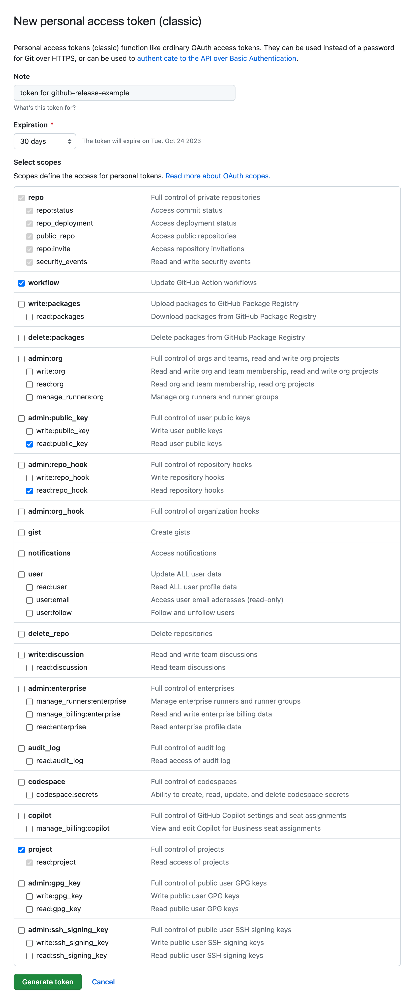
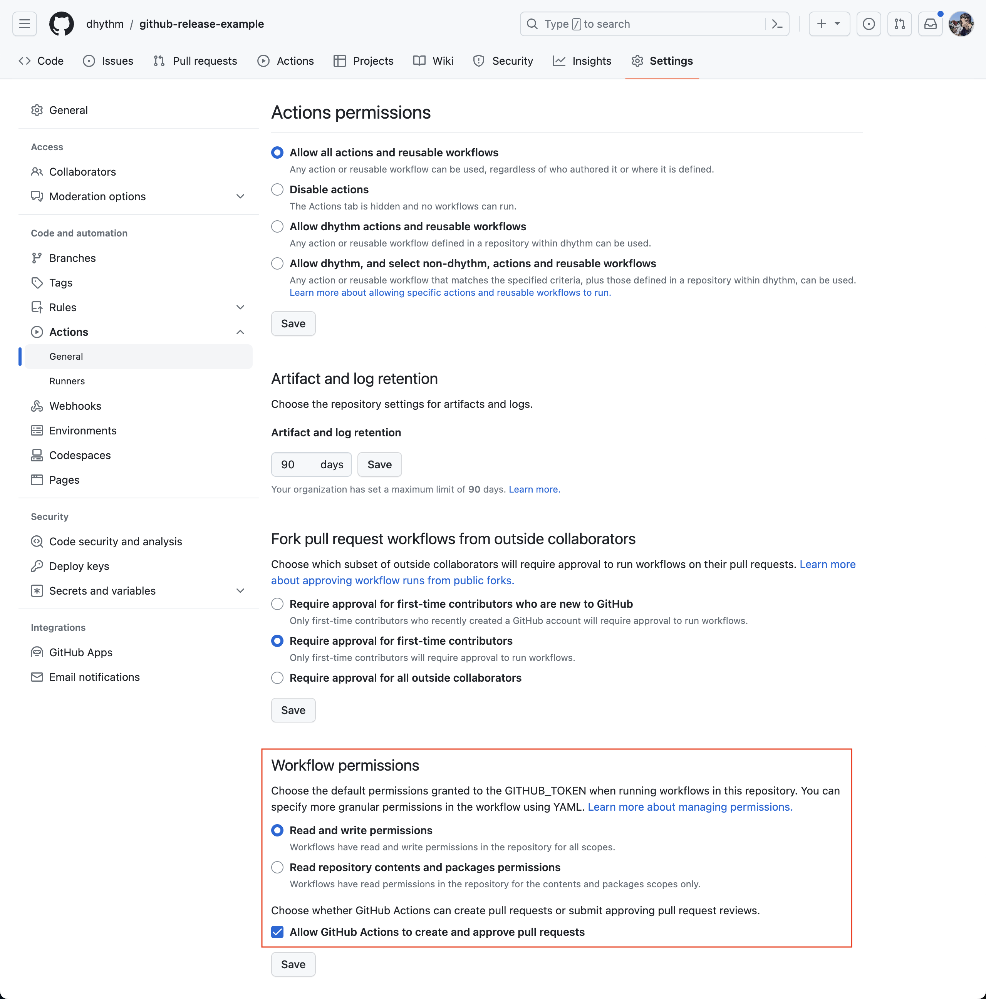
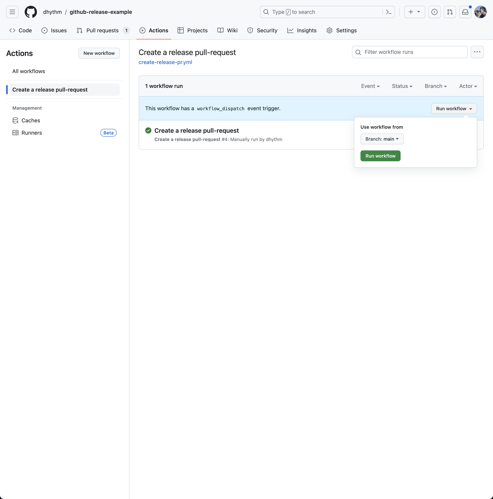
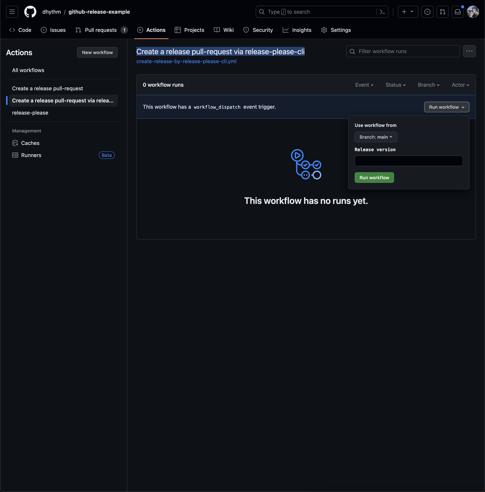

# github-release-example

## Prework

### Install and run Docker

Go to [docker site](https://www.docker.com/) and get docker.
After then, run Docker on your PC.

### Install act

[act](https://github.com/nektos/act) helps developments for GitHub Actions.
Run the following command to install act.

```sh
brew install act
```

### Get GitHub Token for development

Go to `Settings` > `Developper Settings` > `Personal access tokens`, then generate a new token.
The token is used for local debugging, so you have to set expiry and you can delete after debugging.



### Set local environment variables

```sh
export GITHUB_TOKEN=<GITHUB_TOKEN>
export BASE_BRANCH=release
export HEAD_BRANCH=main
export OWNER=dhythm
export REPO=github-release-example
export TEMPLATE=.github/git-pr-release.template
export LABELS=release
```

You can check environment variables by `printenv`.

### Create manifest.json and config for release-please

Run the following command, then release-please will make a PR to add both initial manifest and config.

```sh
npx release-please bootstrap --token=<GITHUB_TOKEN> --repo-url=dhythm/github-release-example --release-type=node
```

## Development

### Debug scripts

Run the following command.

```sh
node .github/src/create_release_pr.js
```

### Debug GitHub Actions

Run the following command.

```sh
act --list --container-architecture linux/amd64
act --secret GITHUB_TOKEN=<GITHUB_TOKEN> -j release_pr --container-architecture linux/amd64
```

## Getting started

### Settings

You have to update `Settings` > `Actions` > `General` > `Workflow permissions`.



### Create a merge PR with template

You can run the workflow in `Actions` > `Create a release pull-request` as the following,



### Create a release PR with release-please

You can run the workflow `Create a release pull-request via release-please-cli` as below,



A release PR will be created. github-release will work after the PR is merged.
A release PR is updated if new commit(s) is pushed into main branch before the release-pr is merged.


### Troubleshooting

You can run forcibly github release via the following command,

```sh
npx release-please github-release --token=<GITHUB_TOKEN> --repo-url=dhythm/github-release-example
```

## References

- https://tech.spacely.co.jp/entry/2023/07/26/100915
- https://damienaicheh.github.io/github/actions/2022/01/20/set-dynamic-parameters-github-workflows-en.html
